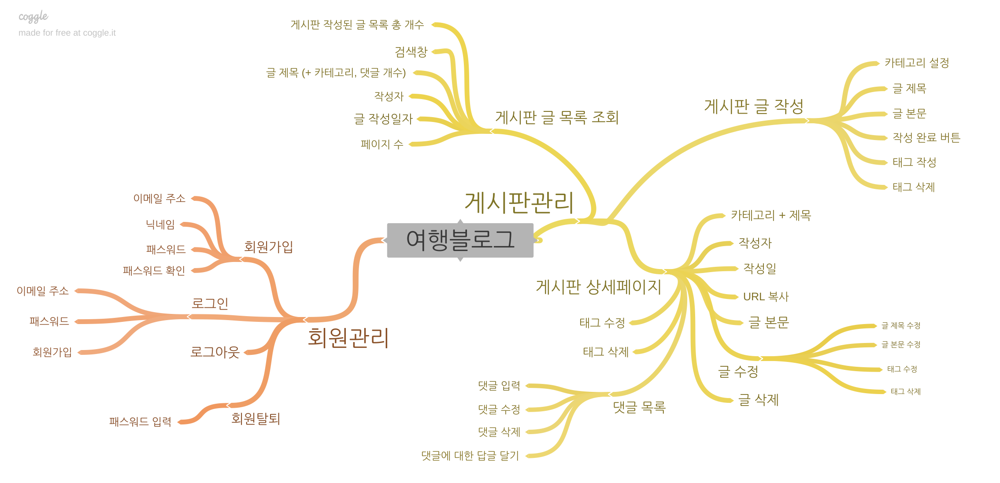
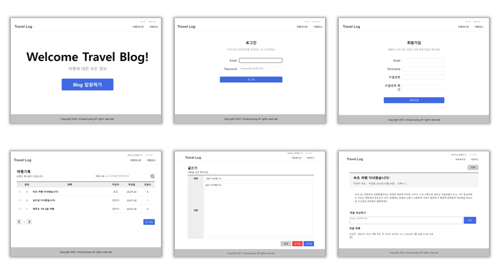
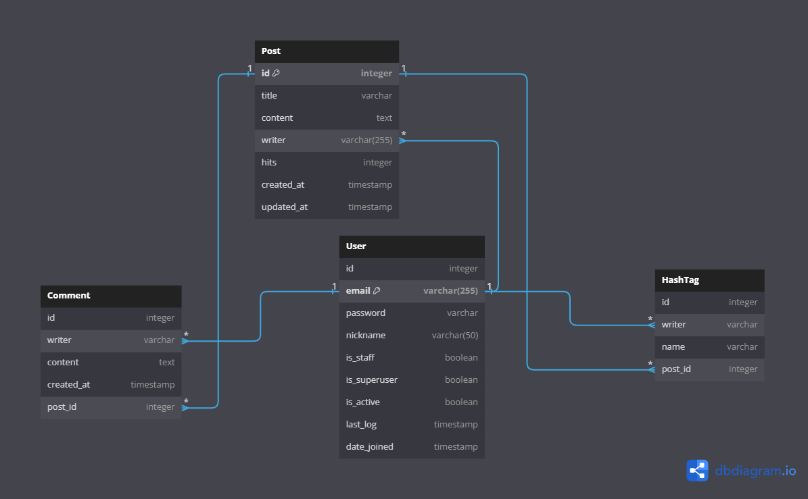
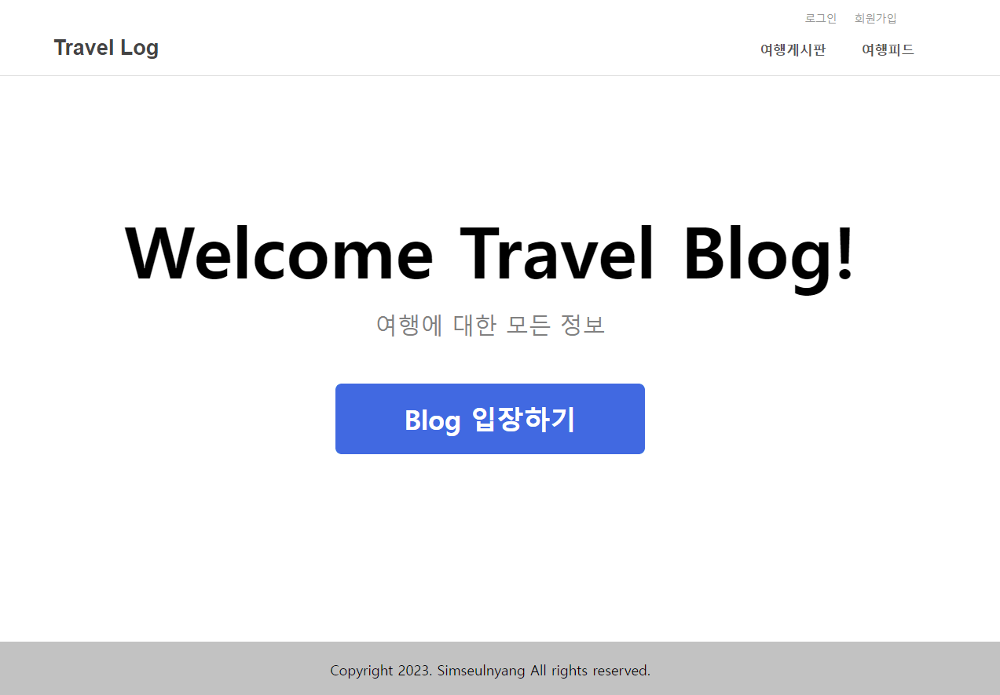
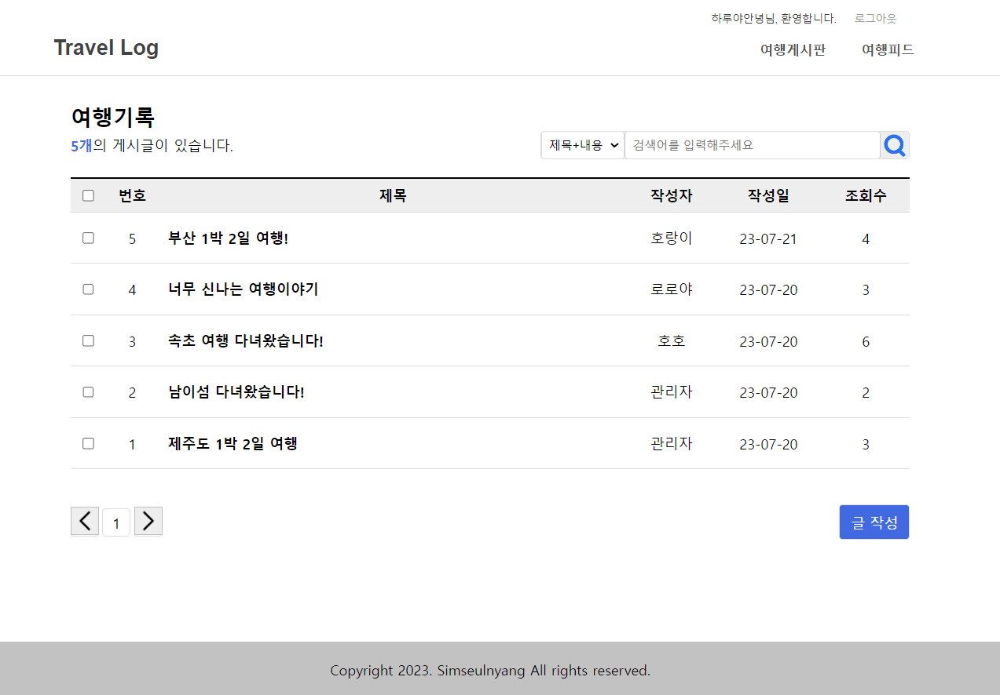
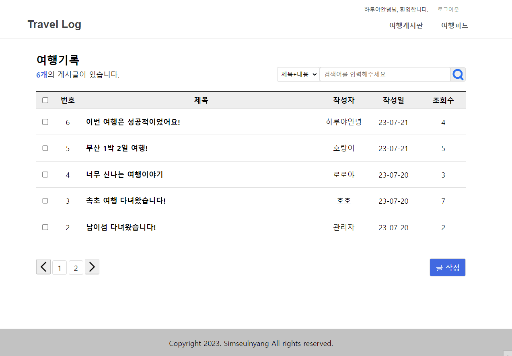
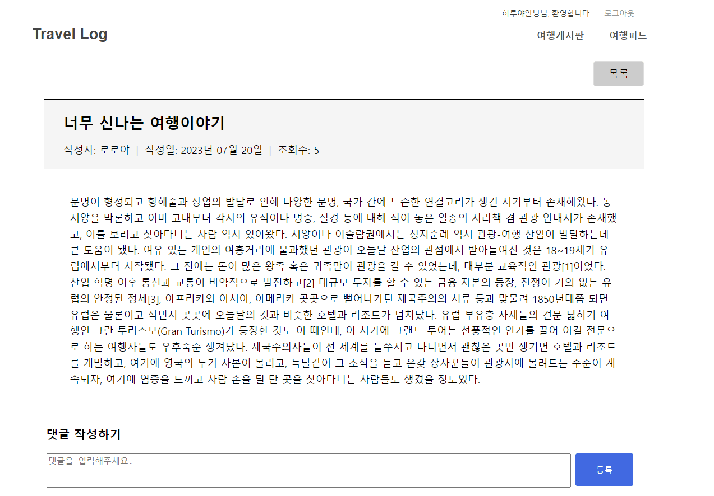

# <span id="top">:floppy_disk:TRAVEL_LOG</span>
여행을 사랑하는 당신의 이야기를 남겨주세요. 누군가에게 당신의 이야기는 꿈을 꾸게 하고 곧 그것을 현실로 만들어 줄 거에요.

## 개요
- :mountain_bicyclist:ESTsoft 백엔드 양성과정 오르미 1기 개인 프로젝트로 진행한 Travel_Log입니다.
- :notebook:Travel_Log는 여행을 좋아하는 사람들이 모여 자신들의 여행이야기를 솔직담백하게 기록하고, 정보를 공유하며, 공감하는 사람들끼리 소통하는 블로그 서비스입니다.

## 목차
<ol>
    <li><a href="#goal">프로젝트 목표</a></li>
    <li><a href="#dev">개발환경 및 배포 URL</a></li>
    <li><a href="#ins">설치 및 실행</a></li>
    <li><a href="#tree">프로젝트 구조</a></li>
    <li><a href="#task">개발기간 및 기능기획관리</a></li>
    <li><a href="#ui">UI</a></li>
    <li><a href="#erd">데이터베이스 모델링(ERD)</a></li>
    <li><a href="#pages">페이지 기능</a></li>
    <li><a href="#issues">개발하며 겪은 이슈</a></li>
    <li><a href="#realization">마무리</a></li>
</ol>
<p align="right"><a href="#top">(Top)</a></p>

<hr>

## <span id="goal">1. 프로젝트 목표</span>
- 사용자들이 자유롭게 여행후기를 남길 수 있는 플랫폼을 제공합니다.
- 원하는 여행정보를 찾기 위해 제목 또는 내용을 검색할 수 있습니다.  

<p align="right"><a href="#top">(Top)</a></p>

## <span id="dev">2. 개발환경 및 배포 URL</span>
 ### 개발환경
    - Django 4.2.3 (Python 3.11.3)
    - HTML5
    - CSS
    - JavaScript
    - sqlite3

 ### 배포 URL
    - 현재 미정
<p align="right"><a href="#top">(Top)</a></p>

## <span id="ins">3. 설치 및 실행</span>
- Terminal에 명령어를 입력하여 실행합니다.
- 설치 및 실행을 위한 단계는 6번까지 입니다.
- 서버 중지 및 가상환경 비활성화는 7번과 8번과정 입니다.
```
# 1. 가상환경 생성 
#     => 가상환경설정이름에 설정하고자 하는 가상환경이름을 넣습니다.
python -m venv 가상환경설정이름

# 2. 가상환경 활성화 => 커맨드 라인 앞에 (venv)가 생성됩니다.
    # macOS
        source venv/bin/activate
    # PowerShell
        venv/Scripts/Activate.ps1
    # CMD
        call venv/Scripts/activate.bat
    # Git Bash
        source venv/Scripts/activate

# 3. 의존성 설치
pip install -r requirements.txt

# 4. 데이터베이스 마이그레이션
python manage.py migrate

# 5. 개발 서버 실행
python manage.py runserver

# 6. 실행 주소
http://127.0.0.1:8000/

# 7. 개발 서버 중지 (win에서는 ctrl + c)

# 8. 가상환경 비활성화 => 커맨드 라인 앞에 (venv)가 사라집니다.
deactivate
```
<p align="right"><a href="#top">(Top)</a></p>

## <span id="tree">4. 프로젝트 구조</span>
- app/ : Django 애플리케이션의 기본적인 세팅 디렉토리
- blog/ : Blog 기능을 담당하는 애플리케이션 디렉토리
- blog/templatetags : 템플릿 필터 파일 디렉토리
- static/ : CSS, JavaScript 등 정적파일이 들어있는 디렉토리
- templates/ : HTML 템플릿 파일 디렉토리
- user/ : User 기능을 담당하는 애플리케이션 디렉토리

```
TRAVEL_LOG
│
├─app
├─blog
│  ├─templates
│  │  └─blog
│  └─templatetags
├─readme
├─static
│  ├─css
│  └─img
├─templates
└─user
   └─templates
      └─user

```
<p align="right"><a href="#top">(Top)</a></p>

## <span id="task">5. 개발기간 및 기능기획관리</span>
 ### 개발 기간
    - 1차 : 2023-07-17 ~ 2023-07-20

 ### 기능기획관리
- 마인드 맵(Focus on 기능구현)

<p align="right"><a href="#top">(Top)</a></p>


## <span id="ui">6. UI</span>

<p align="right"><a href="#top">(Top)</a></p>

## <span id="erd">7. 데이터베이스 모델링(ERD)</span>

<p align="right"><a href="#top">(Top)</a></p>

## <span id="pages">8. 페이지 기능</span>
| 1. 로그인화면 | 2. 회원가입 화면 |
|---|---|
|  |  |

| 3. 글 쓰기화면 | 4.글 수정화면 |  
|---|---|
|  |  |

| 5. 글 검색화면 | 6. 댓글작성 및 삭제 |  
|---|---|
|  |  |
<p align="right"><a href="#top">(Top)</a></p>

## <span id="issues">9. 개발하며 겪은 이슈</span>
 ### 1) Django의 SECRET_KEY 분리 설정
 #### 내용
 - Django Project를 생성하면 settings.py 안에  SECRET_KEY도 같이 생성됩니다.
 - SECRET_KEY란 특정 Django 설치를 위한 비밀키이며 암호화 서명을 제공하는 데 사용되기 때문에 고유하고 예측할 수 없는 값으로 설정해야 합니다.
 - GitHub에 commit 할 때 settings.py를 커밋하면 SECRET_KEY가 노출됩니다. 하지만 SECRET_KEY가 없으면 프로젝트가 실행되지 않기 때문에 이번 프로젝트부터 SECRET_KEY를 노출하지 않으면서 관리할 수 있는 방법에 대해 생각해 보았습니다.

 #### 결론
  - 찾아보니 환경 변수를 이용한 방법과 외부에 저장하는 방법 2가지가 확인되었고 이 중에서 외부에 저장하는 방법을 선택하였습니다.
  - 보통은 secret.json을 생성하여 관리하지만 my_settings.py을 생성하여 관리하는 방법을 선택했습니다.
    
    1. manage.py와 같은 위치상에 my_settings.py를 생성합니다.

    2. settings.py에서 SECRET_KEY를 가져와 my_settings.py에 붙여넣습니다.
        ```
        # my_settings.py
        SECRET_KEY = "본인 장고 secret key"
        ```
    3. settings.py에 my_settings.py를 import 하고, SECRET_KEY에 my_settings.SECRET_KEY 값을 넣어줍니다.
        ```
        #settings.py
 
        import my_settings
 
        SECRET_KEY = my_settings.SECRET_KEY
        ```
    4. GitHub에 commit하기 전 꼭 .gitignore에 등록하여 파일을 숨겨줍니다.

 ### 2) 게시글 검색 및 페이징 오류
 #### 내용
  - 게시글 목록에서 주제별 키워드를 검색하면 해당 게시글 목록만 화면에 그려지는 코드를 구현하려고 했습니다.
  - 검색 기능에 대한 url과 view.py에 class를 따로 작성해야 한다고 생각하고 url 설정 및 PostSearch라는 클래스에 검색과 페이징을 함께 처리할 수 있도록 코드를 작성했습니다.
  - 작성한 코드가 제대로 작동되지 않아 코드 위치도 변경해보고, 다른 블로그 코드를 참고해보기도 하고, JavaScript의 click event도 사용해보았지만 아무런 반응이 없었습니다.

 #### 결론
  - 강사님께 조언을 구했고 해당 코드는 굳이 url 및 class를 새로 작성할 필요 없이 게시글 목록을 보여주는 class에 추가하여 작성하면 된다는 사실을 알게되었습니다.
  - class Postlist 안에 검색 및 페이징 할 수 있는 코드를 추가했습니다. 그리고 템플릿에서 잘못된 변수 값을 지정하고 있었다는 것을 깨닫고 해당 코드도 함께 수정했습니다.

 ### 3) 게시판의 게시글 번호 처리하기 - 템플릿 필터 사용
 #### 내용
  - 게시글 목록에 번호 순서가 내림차순으로 정렬되어 나타나도록 표현하고 싶었습니다.
  - 하지만 게시글이 5개가 넘어갔을 때 다음 페이지에서 보여지는 번호가 1번으로 나타나는 오류를 발견했습니다.
  - 총 게시글이 만약 10개라면 1번 페이지의 최신 글의 번호는 10번이고, 2번 페이지의 최신글은 6번으로 나타나도록 수정하고 싶었습니다.

 #### 결론
  - 페이지별로 게시물의 번호를 역순으로 정렬하기 위해서 공식이 있고 해당 공식을 게시글의 번호 나열에 적용하면 되는 사실을 알았습니다.
    ```
    게시글 번호 = 전체건수 - 시작인덱스 - 현재인덱스 + 1

    * 시작인덱스 : 페이지당 시작되는 게시물의 시작번호
                    => 게시물을 10개씩 보여줄 때 1페이지의 시작인덱스는 1,
                        2페이지의 시작인덱스는 11이 됩니다.
    * 현재인덱스 : 페이지에 보여지는 게시물 개수만큼 0부터 1씩 증가되는 번호
    ```
  - 이런 공식을 적용하여 게시글의 번호는 템플릿에서 변환되어야 한다고 생각했습니다. 그래서 이 기능을 위해 사용하고자 한 방법이 템플릿 필터입니다.
  - 탬플릿 필터란 탬플릿 태그에서 | 문자 뒤에 사용하는 필터로 변수를 처리하는 기능입니다. 
  - 템플릿 필터 파일들을 저장할 templatetags 디렉토리를 blog 앱 하위에 생성하고 blog_filter.py 파일을 생성한 다음 아래의 코드를 작성하여 저장하였습니다.
    ```
        # templatetags/blog_filter.py

        from django import template

        register = template.Library()


        @register.filter
        def sub(value, arg):
            return value - arg
    ```
  - sub라는 함수 위에 register.filter 애너테이션을 적용하면 템플릿에서 해당 함수를 필터로 사용할 수 있습니다. 이 기능을 적용하기 위해 post_list.html 템플릿으로 이동하고  상단에 를 추가하여 파일을 로드해주었습니다. 그 다음 게시글 번호가 출력될 수 있도록 해당 위치에 아래의 코드를 입력하여 수정하였습니다.

    ```html
    
     <!-- 템플릿 필터 함수를 사용하기 위한 파일 로드 -->
    

                <!-- 이하 코드 생략... (줄이 너무 길어서 생략함) -->
        <thead>
        <tr>
            <th>
            <input type="checkbox" id="all-article">
            <!-- <label for="all-article">페이지 전체 게시글 선택</label> -->
            </th>
            <th>번호</th>
            <th>제목</th>
            <th>작성자</th>
            <th>작성일</th>
            <th>조회수</th>
        </tr>
        </thead>
        <tbody>
            
                
                    <tr>
                        <td>
                            <input type="checkbox">
                        </td>
                            <!-- 게시글번호 처리를 위한 구문 시작 -->
                        <td>
                            {{ posts.paginator.count|sub:posts.start_index|sub:forloop.counter0|add:1}}
                        </td>
                            <!-- 게시글 번호 처리를 위한 구문 끝 -->
                        <td>
                            <a href="">{{ post.title }}</a>
                        </td>
                        <td>{{ post.writer.nickname }}</td>
                        <td>{{ post.created_at|date:'y-m-j' }}</td>
                        <td>{{ post.hits }}</td>
                    </tr>
                
            

                <!-- 이하 코드 생략... (줄이 너무 길어서 생략함) -->

            * posts.paginator.count : 전체 건수
            * posts.start_index : 시작인덱스
            * forloop.counter() : 현재인덱스
    ```

<p align="right"><a href="#top">(Top)</a></p>


## <span id="realization">10. 마무리 </span>
 ### 느낀점
 - 스케줄 관리 미흡
    - 프로젝트 기간이 짧은 만큼 Django를 어떻게 하면 더 잘 다룰 수 있을까에 집중하기로 했다면 과감하게 UI를 포기할 필요가 있었다는 생각이 들었습니다. UI에 집중하는 시간이 길어질수록 구현할 기능들이 뒤로 미뤄지게 되고 결국 목표했던 구현 기능 중 일부 (카테고리, 태그)기능을 완성하지 못했습니다.
 
 - Django는 어려운데 재밌다!
    - 생각보다 Django 내부에서 제공하는 기능들이 많고, 찾아보면 Django에서 이런 기능도 제공한다고? 하는 생각이 드는 부분도 있었습니다.

 ### 다음 목표
 - 프로젝트 기간은 끝이 났지만 이 프로젝트에 구현하고 싶은 기능들이 있어 다음 목표를 설정했습니다.

- 1차 목표 (현재)
    - Django 강의에서 배운 내용들을 복습하며, 프로젝트의 핵심인 블로그 게시글의 CRUD 기능 구현에 익숙해진다.
    - 제공된 GitHub repo의 HTML+CSS를 기본으로 UI 커스터마이징하고, FBV보다는 CBV를 사용하여 개발한다.
    - ERD 작성 툴을 사용하여 데이터베이스 구조를 설계한다.

- 2차 목표 (오르미 1기 끝나기 전까지)
    - 블로그
        - HashTag, Category 기능을 추가하여 게시글을 조회, 검색, 정렬 할 수 있다.
        - like(좋아요) 기능을 추가하여 관심있는 블로그 게시글에 표현할 수 있다.
        - Pillow 이미지 처리 라이브러리를 사용하여 이미지 등의 정적파일을 저장할 수 있도록 한다.
        - 프로젝트에 Toast-ui-editor합쳐 Markdown 문서를 편집할 수 있도록 한다.
    - 유저
        - Profile 관련 Model을 설정하고, User가 직접 이미지를 포함한 자신의 프로필을 설정할 수 있고, 해당 내용을 DB에 저장하여 관리할 수 있다.
        - 유저 본인이 본인의 비밀번호를 직접 수정할 수 있다.
        - 회원탈퇴를 원하는 경우 본인의 비밀번호를 입력하여 회원탈퇴를 진행할 수 있다.

<p align="right"><a href="#top">(Top)</a></p>